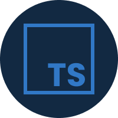

<div align="center">
  <h1>FeedGet</h1>
</div>


## About
FeedGet is a reusable widget for feedback.

## Technologies
### React (Web)
[](https://reactjs.org/)

### React Native (Mobile)
[](https://reactnative.dev/)

### NodeJS (Server)
[](https://nodejs.org/en/)

### Typescript (Web, Server & Mobile)
[](https://www.typescriptlang.org/)

### Prisma ORM (Server)
[](https://www.prisma.io/)

### ViteJS (Web)
[](https://vitejs.dev/)

### TailwindCSS (Web)
[](https://tailwindcss.com/)

## Layout
You can access the Figma template [here](https://www.figma.com/file/RArvOWvvUsn8232ZOpF8MZ/Feedback-Widget-(Rocketseat)?node-id=100%3A2114).

## Usage
- Clone the project with `git clone https://github.com/Eduardo-H/feedget.git`

To be able to use this project, it is necessary to inform some enviroments variables on the <strong>server</strong> and <strong>mobile</strong> project. The server project uses the [Mailtrap](https://mailtrap.io/) service to send emails, so your going to need to have an account on their platform. 

Here's the template of the `.env` file that you need to create in the <strong>server</strong> project:
```javascript
# Server Enviroments Varibles
DATABASE_URL="file:./dev.db"
MAILTRAP_USER=YOUR_MAILTRAP_USER
MAILTRAP_PASS=YOUR_MAILTRAP_PASS
```

Here's the template of the `.env` file that you need to create in the <strong>mobile</strong> project:
```javascript
# Mobile Enviroments Varibles
IP_PORT=YOUR_PC_IP_PORT
```

After setting up the environment variables, you can follow these steps to run the server:
- Enter the server project by running `cd server/`
- Install the server project's dependencies with the command `yarn`
- Run `yarn dev` to start the server (you'll need to set the enviroments variables in .env file before running the server)

Now that your server is running, you can either run the web application or the mobile app.

To run the web application, follow these steps:
- Open another terminal on the project's root directory and use `cd web/` to navigate into the web project
- Install all the dependencies with `yarn`
- Run `yarn dev` to start the web application

To run the mobile app, follow these steps:
- Open another terminal on the project's root directory and use `cd mobile/` to navigate into the mobile project
- Install all the dependencies with `yarn`
- Run `expo start` to start the mobile app (you'll need to have Expo CLI installed to make this step work, you can click [here](https://docs.expo.dev/workflow/expo-cli/) to install it)